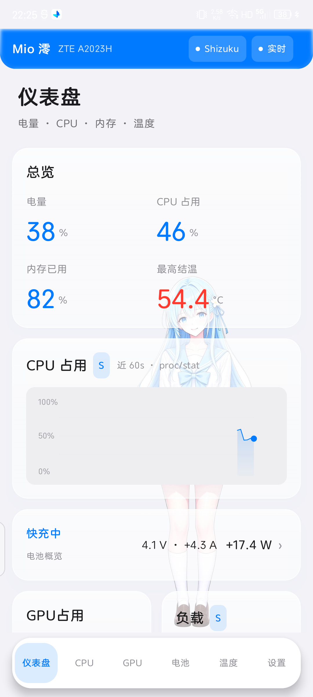
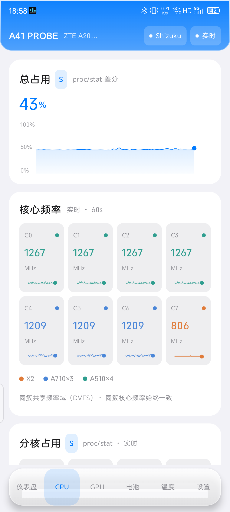
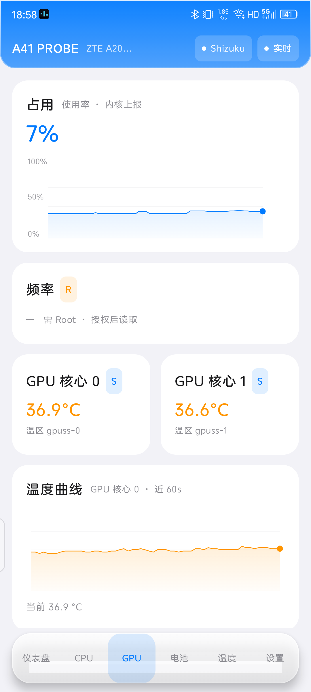
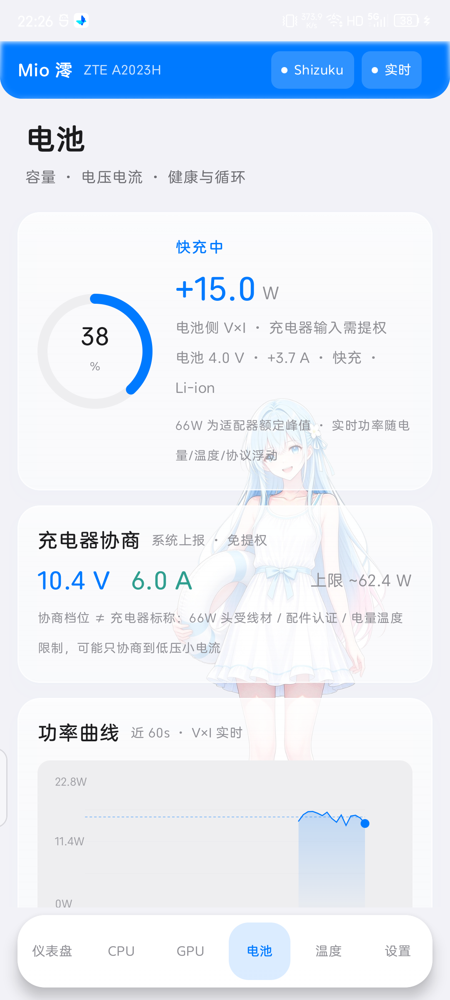
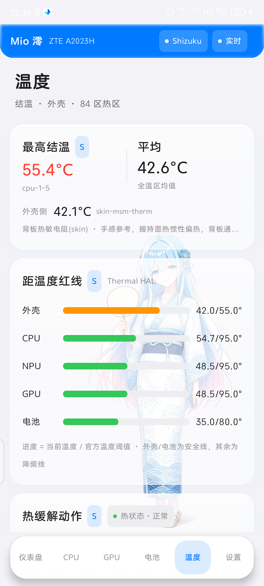
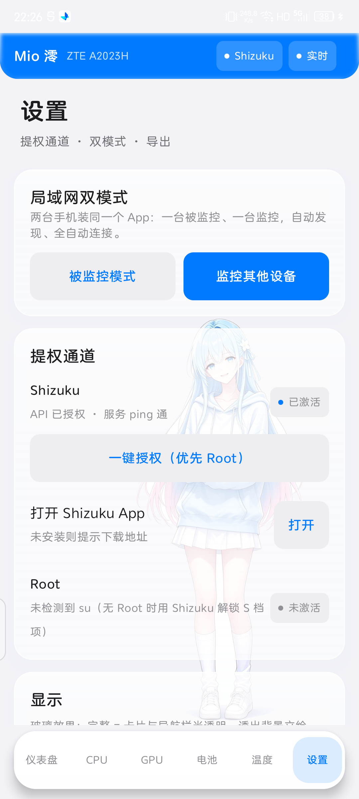

<div align="center">

# Mio 澪

**把手机里那颗芯片，摊开给你看。**

CPU 在飙还是摸鱼、GPU 热不热、电池此刻灌进去多少瓦、84 个温度点谁最先撑不住——
打开它，一屏看完。旁边还有个叫「澪」的姑娘陪你一起看。

<br/>




<sub>真机实拍 · 中兴天机 A41 Ultra（骁龙 8 Gen1 / Adreno 730）· 全部截图均未修图</sub>

</div>

---

## 先说三件最要紧的

**一、纯只读。** 不写任何系统节点、不改任何设置、不申请多余权限。它只是"看"，看完就走。

**二、不 root 也能用。** 装上就有电量、内存、传感器、大部分机型的 CPU 频率与占用。装了 [Shizuku](https://shizuku.rikka.app/)（不 root，一条命令的授权）之后，热区温度、CPU 占用、充电器输入侧电压电流全部解锁。

**三、读不到就说读不到。** 拿不到的值显示「–」并告诉你为什么、去哪授权——**绝不用 0 糊弄你**。一个监控工具最不能做的事，就是把猜的数字当真的端上来。

---

## 还有一位看板娘：澪

这不是那种塞个吉祥物贴纸就算了的 App。

**澪（Mio）** 是这台监控台的"操作员"：每个页面有自己的立绘，右侧站着、跟着页面换衣服；

| | |
|---|---|
| **7 张分页立绘** | 仪表盘 / CPU / GPU / 电池 / 温度 / 传感器 / 设置，各有站位与姿态，卡片半透明，她会从卡片底下透出来 |
| **5 种表情差分** | 打招呼、害羞、思考、惊叹、出发——用在弹窗、空态与引导里，语气也跟着变 |
| **10 页新手引导** | 由她带着走一遍：三档权限是什么、每个页面能看什么、哪些数据需要授权 |
| **人设化文案** | 比如权限弹窗标题写的是「澪来解释三档权限」；读不到数据时她会说"这块需要授权哦"，而不是冷冰冰一句"权限不足" |
| **开屏与图标** | 立绘贴底的启动画面 + Q 版澪头像的自适应图标 |

立绘全部由作者手工抠底成透明 PNG，为此专门折腾过一轮（白边、贴图感、头部被裁——都修过）。**如果说数据是这个 App 的骨架，澪就是它的脸。**

---

## 截图

<div align="center">

| CPU | GPU |
|:---:|:---:|
|  |  |

| 电池 | 温度与散热 |
|:---:|:---:|
|  |  |

| 设置 | |
|:---:|:---:|
|  | <sub>玻璃效果三档、触感强度三档，都在这里</sub> |

</div>

---

## 能看到什么

### CPU
每核的当前频率与占用、**动态分簇**（超大核 / 性能核 / 能效核，各有专属颜色）、总占用曲线、**频率档位驻留**（过去一段时间里 CPU 各停在哪些频率上、各占多少）、governor 与各簇限频、loadavg。

### GPU
占用曲线、频率、GPU 核心温度。高通 Adreno、ARM Mali、联发科 GED 三类节点自动识别——换机器不用改代码。

### 电池
电量环、充放电状态、电压 / 电流 / 功率、**充电器协商上限**。功率口径是反复较真过的：充电时优先用**适配器输入侧**的 V×I，而不是电池侧，否则一充电两个数字就打起来。还有健康度、设计容量 / 学习容量、循环次数、OCV、截止电压、充入电量、限流档位、24h 容量趋势、以及按当前功率估算的充满 / 续航时间。

### 温度与散热
最高**结温**、平均、外壳（手感）温度三条线分开给——结温必然高于外壳，混在一起看就全错了。还能看**距温度红线**（离降频/关机还有多远）、当前生效的**热缓解动作**（谁在降频、降到第几档）、按 CPU / GPU·NPU·内存 / 射频·充电·外壳 分组的全部热区，以及一张 **84 格热图**。

### 内存 / 传感器 / Thermal HAL
内存与 Swap 明细；加速度、陀螺仪、磁力计、光线、距离等真实物理量；以及直接问系统的 Thermal HAL 要一份分类温度（CPU/GPU/电池/外壳/电压/电流/电量/NPU）与热状态等级。

---

## 两部手机，一块屏

手里有两台安卓手机？装同一个 App，一台当**被监控端**、一台当**监控端**，就能隔空看另一台机器的实时状态。

- 被监控端：前台服务每秒采集，通过 mDNS 自动广播，局域网内直推
- 监控端：自动发现、自动连接，可以**同时看多台**；每台一张卡（CPU 各核频率、结温、电量、HAL 温度、内存 / GPU / 充电），点进去还有单独的历史曲线页
- 数据不出局域网。没有服务器、没有账号、没有云端

被监控端做了常驻通知、开机自启、JobScheduler 兜底，甚至会在 OPPO / vivo / 小米 / 华为 / 三星上**逐项引导你关掉电池优化**——因为国产 ROM 杀后台是真的凶。

---

## 权限：三档，可退可进

| 档位 | 能多看到什么 |
|---|---|
| **免提权**（默认） | 电量、电池温度与电压、内存、传感器、部分 GPU 占用、多数机型的 CPU 频率 |
| **Shizuku**（推荐，不用 root） | 热区温度、散热动作、CPU 占用、充电器输入侧 V/I、更多 sysfs 节点 |
| **Root** | 再解锁个别被 SELinux 挡住的节点（比如某些机型的 Adreno GPU 频率） |

没授权也不会给你一片空白——相关卡片变空态并附一句"去授权"，随时点随时升。

---

## 好看这件事，也认真做了

- **玻璃效果三档**：`完整` 半透明 + 顶部高光 + 光泽柔化（Android 12 以上走 RenderEffect）；`简约` 更实、少一层叠加、更省电；`关闭` 全实色。切换立刻生效，不重启。
- **触感反馈**：Tab 与卡片按下都有震动，强度分 **轻 / 中 / 重**。最好玩的是设置页那三个键——**按住不放会一直震，松手即停**，可以直接比手感。
- **动效统一**：全局只有一条缓动曲线和一组时长（按下 130ms、松开 240ms、Tab 指示器 280ms、数字 320ms）。Tab 指示器是滑过去的不是跳过去的；卡片按下会轻微收缩 + 阴影下沉 + 变暗，松手顺滑回弹。
- **文字和图表永远在最上层**，只让玻璃层模糊，绝不把内容糊掉。
- **数字不跳**：CPU 占用、温度、内存这些每秒都在变的值都做了插值滚动。
- **尊重系统设置**：系统关掉动画（Reduce Motion）时，所有动效直接切换，不做多余表演。

---

## 数据带走

设置里可以导出 CSV，分三段：**META**（时刻 / 机型 / 版本）、**RAW**（内核原始单位、零换算、附来源节点路径）、**RENDERED**（和界面上一模一样的换算值与所属页面）。

想拿去做图、做对比、做机型库都行——RAW 区留着原始值，就是为了让别人没法在口径上跟你吵。

---

## 安装

1. 到 [Releases](../../releases) 下载最新 APK；
2. 手机允许「安装未知来源应用」，直接装（**Android 8.0 及以上**）；
3. 想要完整数据就再装 [Shizuku](https://shizuku.rikka.app/) 并在 App 内一键授权——**不装也能用**。

第一次打开会有 10 页引导，澪会带你认一遍每个页面。

---

## 关于工程

| | |
|---|---|
| 语言 / UI | Kotlin 2.0.21 · Jetpack Compose（Material 3） |
| 构建 | AGP 8.7.3 · Gradle 8.10.2 · JDK 17 |
| 支持范围 | minSdk 26（Android 8.0）· targetSdk 34 |
| 架构 | 单 Activity + Compose · ViewModel + 细粒度 StateFlow · 分层回退的硬件 Reader |
| 网络 | 仅局域网：mDNS(NSD) 发现 + TCP 长连接 |

几个自己比较满意的点：

- **一套口径**：本机界面和被监控端调用同一个采集器，"自己看到的"和"推给另一台手机的"是同一份数据、同一套换算，不会两边对不上。
- **提权读取只走一次跨进程**：一条 shell 命令批量取回热区 / 频率 / loadavg / cooling，每帧的跨进程往返从 11 次以上压到 1 次。
- **不写死机型**：SoC、GPU、热区、电源节点全部按平台探测 + 逐级回退，换台机器大概率直接能用。
- **细粒度订阅**：每张卡片只订阅自己需要的数据，没变就不重组；滚动用的上下文是动态 `compositionLocal`，避免滚动时整页重算。
- **冷启动和回前台很快**：先出电量与内存的轻快照再补富数据，回前台只合并不倒退，不会闪一下"需要授权"。

---

## 已知限制（说在前面）

- **只读**：需要写权限才能拿到的数据，它拿不到
- **GPU 频率**：个别机型（比如中兴 A41 Ultra）对 App 和 shell 都拒绝访问该节点，只能 Root
- **触感强弱**：少数机型的厂商 HAL 不暴露振幅接口，这时"轻 / 中 / 重"只能靠时长与波形区分，做不出真正的强弱层次
- **后台保活**：国产 ROM 该杀还是杀，已经内置多重保活和厂商设置引导，但仍需你在系统里放行
- **语言**：目前只有简体中文，文案还没抽成字符串资源

---

## 隐私

不联网、不采集、不上传。本机监控完全离线；双模式只在局域网里点对点传；CSV 只写到本机「下载」目录。

---

## 自己构建

```bash
# JDK 17 + Android SDK 34
./gradlew assembleDebug
# 产物：app/build/outputs/apk/debug/app-debug.apk
```

---

## 许可

[MIT](LICENSE)

<div align="center"><sub>用数据说话。澪会陪着你。</sub></div>
