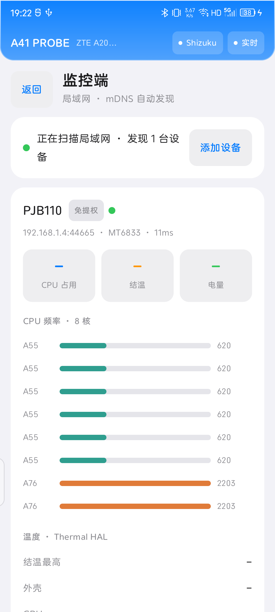
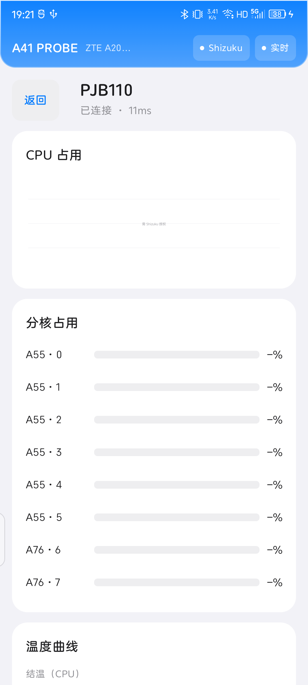

# A41 Probe

### 清新、克制、工具感的安卓硬件参数性能监控

像电脑「任务管理器」一样，实时看懂手机的 CPU、GPU、电池、温度与传感器。
**纯只读 · 免提权即可用 · 支持局域网多设备监控**

 

 

---

## 截图预览

  
  
  

  
  
  

  

---

## 功能总览

### 仪表盘
- CPU 总占用、最高结温两大核心数字，一眼抓住重点
- CPU 占用近 60 秒实时面积曲线（`/proc/stat` 差分）
- 全部核心实时频率：按簇着色的进度条 + 频率数值
- 电池大卡：电量环、充/放电状态、电压、电流、`V×I` 功率、健康度 / 满充容量 / 循环次数
- GPU 占用、内存（可用 / 总量 + Swap 占用条）、电池温度

### CPU
- 总占用大数字 + 实时曲线
- 每核频率卡片（含迷你趋势线），按簇着色
- 分核占用网格
- 档位驻留（`time_in_state`）归一化柱状图，当前档位高亮
- 调度信息：governor、各簇频率上限、降频 / 限频事件

### GPU
- 使用率大数字 + 实时曲线（内核上报）
- GPU 频率：多节点回退探测（高通 kgsl / Mali / MTK / devfreq）
- GPU 核心 0 / 1 独立温度
- GPU 温度曲线

### 电池
- 充电 / 放电状态、电压、电流、功率（带符号）
- 功率曲线（当前值 / 均值虚线）
- 电压、电流双曲线（固定量程，快充峰值不截顶）
- 电池温度曲线
- 详情：健康状态、设计 / 满充容量、循环次数、充电类型（快充 / 标准 / 涓流）、电池技术
- 24 小时容量趋势

### 温度与散热
- 最高结温、全温区平均值
- 外壳侧温度（skin 热敏电阻，对应真实手感）
- 距降频红线：Thermal HAL 各部件（外壳 / CPU / NPU / GPU / 电池）当前值与官方降频阈值
- 热缓解动作：各 cooling 节点限频档位实时展示

### 传感器
- 加速度、陀螺仪、磁力、光线、距离等实时通道多轴数值
- 全部传感器清单（名称 / 厂商 / 类型）

### 数据导出
- 一键导出 **三区 CSV**：`META`（设备与口径）/ `RAW`（原始读数）/ `RENDERED`（屏幕实际显示值），便于核对
- 保存至下载目录，保留最近若干份

---

## 三档权限：免提权也能用

不授权不会整块空白；授权越深，可读参数越多。应用按实际通道自动选择，失权自动回退。

| 能力 | 免提权 | Shizuku | Root |
|---|:---:|:---:|:---:|
| 电池基础（电量 / 电压 / 电流 / 温度 / 健康 / 循环） | ✅ | ✅ | ✅ |
| CPU 当前频率 / governor / 档位驻留 | ✅ | ✅ | ✅ |
| 内存、传感器、设备基础信息 | ✅ | ✅ | ✅ |
| GPU 使用率（部分机型） | ✅ | ✅ | ✅ |
| 全量热区、精确 CPU 占用、负载 | – | ✅ | ✅ |
| CPU 深层 / 受限频率节点 | – | ✅ | ✅ |
| Mali / MTK GPU 频率与占用 | – | ✅ | ✅ |
| 超大核（如 X2）频率上限 | – | – | ✅ |
| 高通 kgsl GPU 频率 | – | – | ✅ |
| 充电器输入侧协商电压 / 电流 | – | 视机型 | ✅ |

> Shizuku 通过 ADB 无线调试激活，无需 Root；Root 设备优先使用 `su` 通道。

---

## 局域网双模式

同一个 App 内置两种角色，两部（或多部）手机装入后即可使用。

- **被监控端（Agent）**
  - 前台服务 + 后台持续采集，支持免提权 / Shizuku / Root
  - 完善防杀保活：前台常驻通知、电池优化白名单、划任务后自动重拉 + 闹钟兜底
  - 内置「厂商后台保活」引导（自启动、应用速冻、多任务加锁），覆盖 OPPO / vivo / 小米 / 华为 / 三星
  - 可随时一键终止
- **监控端（Monitor）**
  - mDNS 在局域网内**自动发现**设备并全自动连接，无需手动输 IP（也支持手动添加）
  - 仪表盘式多设备卡片：型号、SoC、延迟、核心拓扑、温度、占用等一览
  - 点入查看任一设备的完整远程详情
  - 离线自动重连、重新发现自愈
- **协议**：mDNS 服务类型 `_a41probe._tcp`；TCP 长度前缀 JSON 帧；**仅局域网直连，不经过云端**

---

## 适配机型

- **深度适配**：中兴天机 A41 Ultra（ZTE A2023H，骁龙 8 Gen 1 / SM8450，1×X2 + 3×A710 + 4×A510，Adreno 730）
- **已真机验证**：OPPO PJB110（天玑 700 / MT6833，6×A55 + 2×A76，Mali-G52）
- **多机型自适应策略**（不依赖机型枚举）：
  1. **分层回退**：标准系统 API → sysfs / proc 节点 → Shizuku / Root
  2. **识别硬件而非机型**：按 Linux cpufreq policy 动态分簇，解析 MIDR 识别 CPU 微架构
  3. **GPU 多平台探测**：Adreno（kgsl）/ Mali / PowerVR / 通用 devfreq
  4. **单位阈值归一化**：自动识别 kHz / MHz、µV / V 等单位并归一
- 仓库附 [`docs/supported_devices.csv`](docs/supported_devices.csv)：172 款常见机型画像与适配分级（S / A / B / C / D），作为参考与社区反馈库
- 系统要求：minSdk 26（Android 8.0），targetSdk 34（Android 14）

---

## 使用须知（重要口径）

- **功率怎么算**：界面功率 = 电池电压 × 电流（`V×I`），充电为正、放电为负。充电器标称值（如 66W）是**额定峰值**，实时功率随电量、温度、协商协议浮动，二者不矛盾。内核 `power_now` 节点在部分机型为坏值，本应用不采用。
- **结温 vs 手感温度**：结温是芯片内部温度（cpuss / gpuss），通常比外壳 / 手感高 15~25°C；手感请看「外壳侧（skin）」。标注为「Cached / 历史峰值」的数值不是当前温度。
- **快充判定**：电流 ≥ 2A 或输入电压 ≥ 9V 判为快充；≥ 0.5A 为普通充电；以下为涓流。
- **同簇同频正常**：同一簇的多个核心共享 DVFS 频率域，频率始终一致属正常现象。
- **缺失不伪造**：读不到的参数一律显示「–」或灰格，不以 0 顶替、不臆造数值。
- **网络范围**：本机监控完全不联网；双模式仅在同一局域网内直连。

---

## 下载与安装

1. 前往 [**Releases**](../../releases) 下载最新 `A41Probe-vX.X.X.apk`
2. 在手机上打开 APK，按提示允许「安装未知来源应用」
3. 安装后直接打开即可；如需更深参数，在「设置」页按引导授权 Shizuku 或 Root
4. 多设备监控：在被监控手机进入「被监控端」启动服务，监控手机进入「监控端」自动发现

> 当前为 debug 签名的社区版本，安装时系统可能提示「未校验 / 风险」，属正常现象。

---

## 技术栈与架构

- **Kotlin** + **Jetpack Compose** + Material 3，单 Activity、MVVM、StateFlow
- 三权桥接：App 域 / Shizuku API（rikka 12.2）/ Root `su`
- 局域网：NSD（mDNS）服务发现 + 原生 TCP Socket，长度前缀 JSON 帧
- 自研轻量图表：面积曲线、迷你趋势线、仪表环、归一化柱状图
- minSdk 26 / targetSdk 34

## 隐私与安全

- **纯只读**：只读取系统公开接口与节点，不写系统、不改任何设置
- 不采集个人数据、无联网上报、无第三方统计 SDK
- 双模式数据仅在局域网内直连传输，不经过任何服务器
- CSV 导出仅保存在本机下载目录

## 免责声明

本软件提供的参数来源于系统公开接口与文件节点，受厂商、固件、驱动影响，个别参数可能缺失或存在偏差，**仅供学习与参考**，不构成任何专业检测或诊断结论。作者不对因使用或无法使用本软件造成的任何后果承担责任。

## 相关文档

- [开发文档](docs/开发文档.md)：架构、采集层、口径、算法、双模式协议、多机型自适应的完整说明
- [机型适配库](docs/supported_devices.csv)：172 款机型画像与适配分级

## 许可证

[MIT License](LICENSE)
